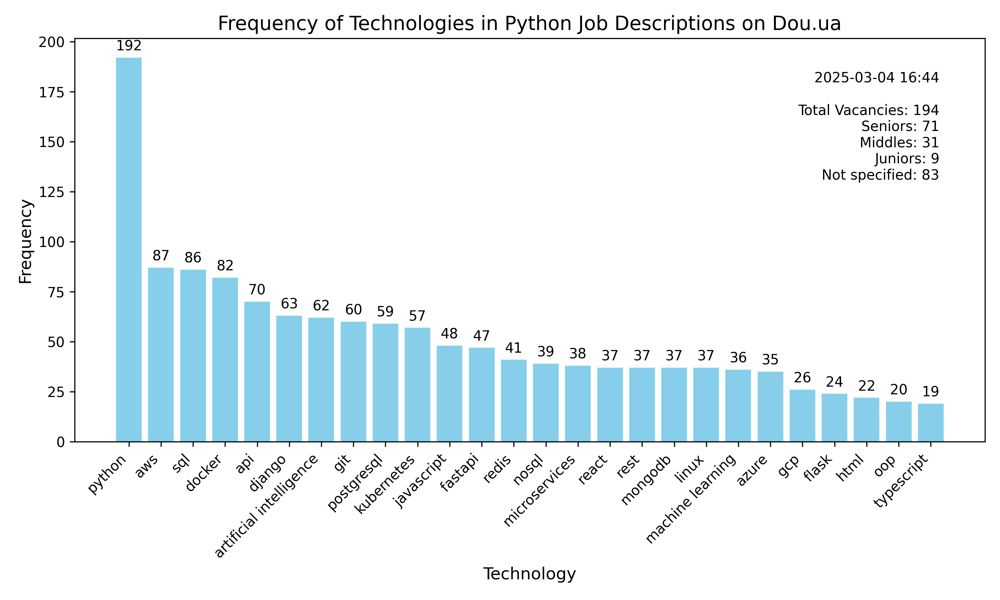

# Python technologies statistics

Web Scraping & Data Analysis project to detect the most demanded technologies in Python vacancies

## Quick Start

To get this project up and running locally on your computer:

1. Python3 must be already installed

2. Assuming you have Python setup, run the following commands (if you're on Mac you may use `python3` instead of `py` to
   start Python):
   ```
   git clone https://github.com/Sashkoooo/py-tech-statistics
   py -m venv venv
   venv\Scripts\activate (on Windows)
   source venv/bin/activate (on macOS)
   pip install -r requirements.txt

   ```
3. Run `python main.py`
4. Go to data/diagrams directory, where you can find recently generated diagram.

## Overview

This application scrapes Python-related job vacancies from jobs.dou.ua,
analyzes the technologies mentioned in job descriptions (determining how often
each technology appears), and generates a frequency diagram of the technologies
(as shown in the demo).

The application operates in three main stages:

1. Collecting job listings – Uses Selenium and BeautifulSoup to gather vacancy references
   and saves them in a .txt file.
2. Extracting job details – Processes the collected references using Scrapy to extract
   job descriptions and saves the data in a .jsonl file.
3. Analyzing technologies – Tokenizes job descriptions with the nltk framework
   to count technology mentions and generate a frequency diagram.

All main code blocks are covered with unit tests to ensure reliability and correctness.

Generated diagrams are in data/diagrams directory

## Demo

